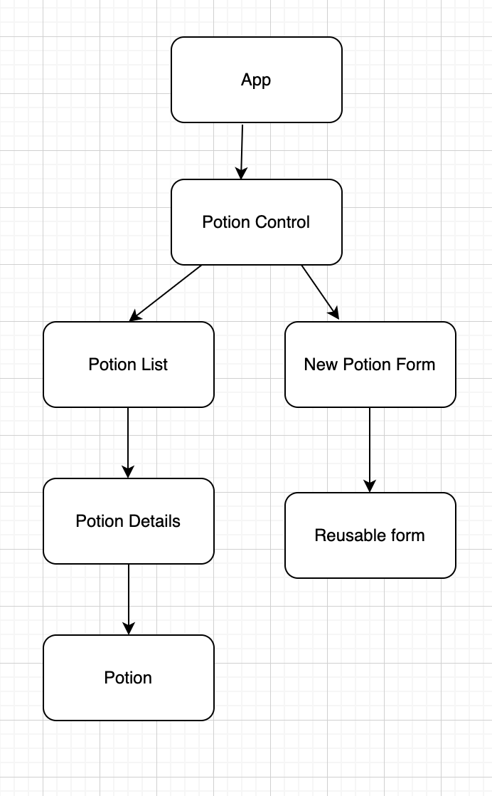
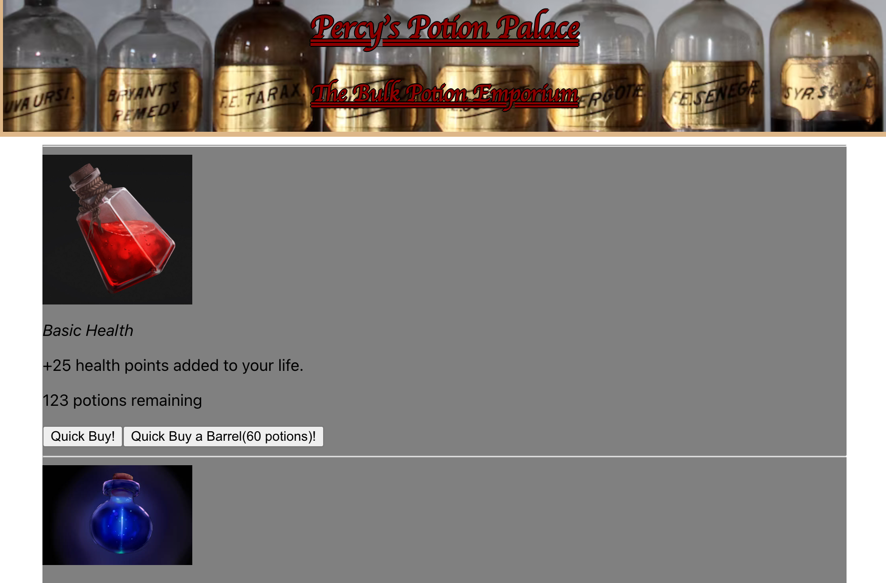
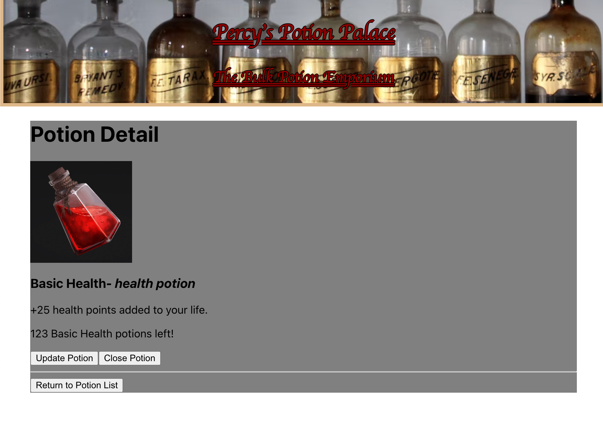
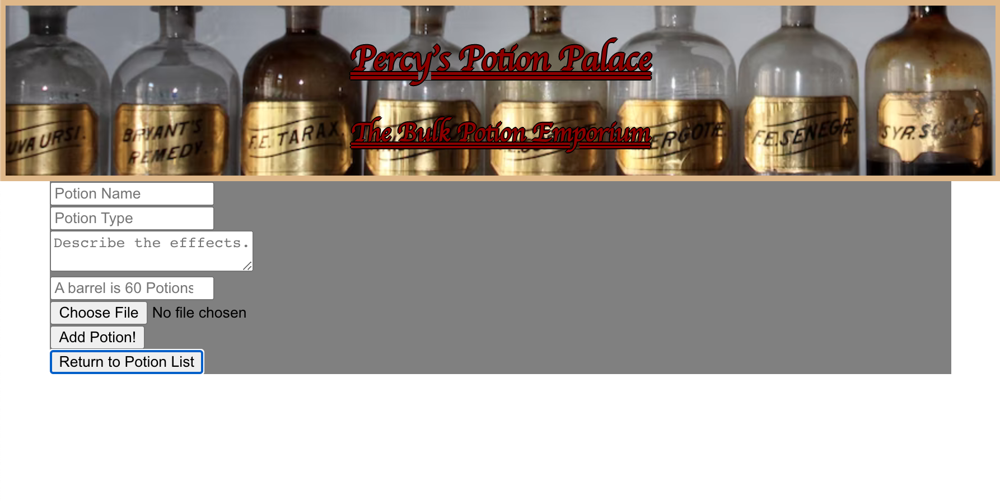

# Percy's Potion Palace Inventory system

#### By Mauro Rosales jr

#### Enables Percy to update the potion inventory in real time

## Technologies Used

* REACT
* JavaScript
* HTML
* CSS
* JSX

## Description

Enables User to have full CRUD funtionality over the Potion inventory. User can "purcahse" from List component, but Edit and Delete from Detail component.

## Setup/Installation Requirements

* Go to https://github.com/maurorosalesjr/potion-palace
* Clone repository
or 
* In terminal / bash type: git clone https://github.com/maurorosalesjr/potion-palace

* Once cloned, in terminal/bash type: npm run build
* then: npm run start

## Known Bugs

* photos dont upload

## Component Tree

## Screen Shots

## License

this is an open source project

Copyright (c) 10/22 Mauro Rosales Jr
